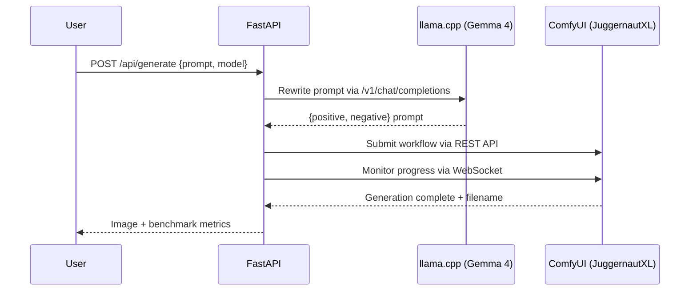

<p align="center">
  <h1 align="center">PixelStudio Pro</h1>
  <p align="center">
    <strong>Local AI image generation with LLM prompt intelligence</strong>
  </p>
</p>

<p align="center">
  
  
  
  
  
  
</p>

---

A fully local, offline AI image generation pipeline that combines **LLM-based prompt rewriting** with a **diffusion image model**. Type a casual natural language description, Gemma 4 rewrites it into a rich diffusion prompt, and JuggernautXL generates a photorealistic image — all running locally on consumer hardware with zero cloud dependency.

**Advanced successor to [PixelStudio](https://github.com/AdityaGuhaa/PixelStudio)** — adds FastAPI orchestration, LLM prompt intelligence, programmatic ComfyUI API control, a custom editorial frontend, and benchmark metrics.

---

## Architecture

```
┌─────────────────────────────────────────────────────────────────────────────┐
│                            PixelStudio Pro Pipeline                          │
├─────────────────────────────────────────────────────────────────────────────┤
│                                                                             │
│   ┌──────────┐     ┌──────────────┐     ┌─────────────────┐               │
│   │  User    │────▶│   FastAPI    │────▶│  llama.cpp      │               │
│   │  Input   │     │   Backend    │     │  (Gemma E2B/E4B)│               │
│   └──────────┘     └──────┬───────┘     └────────┬────────┘               │
│                            │                      │                         │
│                            │◀─── rewritten prompt─┘                         │
│                            │                                                │
│                            ▼                                                │
│                    ┌───────────────┐     ┌─────────────────┐               │
│                    │  ComfyUI API  │────▶│  JuggernautXL   │               │
│                    │  (REST + WS)  │     │  (SDXL v9)      │               │
│                    └───────┬───────┘     └─────────────────┘               │
│                            │                                                │
│                            ▼                                                │
│                    ┌───────────────┐                                        │
│                    │   Frontend    │                                        │
│                    │  (Dark Theme) │                                        │
│                    └───────────────┘                                        │
│                                                                             │
└─────────────────────────────────────────────────────────────────────────────┘
```



---

## Key Features

| Feature | Description |
|---------|-------------|
| **LLM Prompt Intelligence** | Gemma 4 rewrites casual descriptions into rich diffusion prompts with lighting, camera, style, and quality descriptors |
| **E2B vs E4B Benchmarking** | Both model sizes available for A/B comparison with latency metrics |
| **ComfyUI Headless API** | ComfyUI controlled entirely via REST + WebSocket — never touched directly |
| **Image Proxy** | FastAPI proxies ComfyUI outputs for same-origin downloads |
| **Benchmark Metrics** | Rewrite latency, generation latency, and total latency returned per request |
| **Fully Offline** | Zero cloud dependency — all models run locally on consumer hardware |
| **Editorial UI** | Dark theme with electric orange accent, Enerblock-inspired grid layout |

---

## Hardware Requirements

| Component | Minimum | Recommended (Tested) |
|-----------|---------|---------------------|
| GPU | RTX 3060 6GB | RTX 4050 6GB GDDR6 |
| RAM | 16GB DDR4 | 24GB DDR5 |
| CPU | 6-core x86_64 | Ryzen 7 7435HS |
| Storage | 20GB free | 40GB+ (models) |
| OS | Ubuntu 22.04 | Ubuntu 24.04 (dual boot) |
| CUDA | 12.0+ | 13.0 |

---

## Project Structure

```
PixelStudio-Pro/
├── backend/
│   ├── main.py                  # FastAPI entry point
│   ├── config.py                # Central configuration
│   ├── routes/
│   │   ├── generate.py          # Single image generation endpoint
│   │   └── compare.py           # E2B vs E4B comparison endpoint
│   ├── services/
│   │   ├── prompt_rewriter.py   # LLM prompt rewriting via llama.cpp
│   │   ├── image_gen.py         # ComfyUI API orchestration
│   │   └── benchmark.py         # Performance metrics tracking
│   └── utils/
│       └── comfyui_workflow.py   # ComfyUI workflow JSON builder
├── frontend/
│   ├── index.html               # Main UI
│   ├── style.css                # Editorial dark theme
│   └── app.js                   # Frontend logic
├── workflows/                   # ComfyUI workflow templates
├── outputs/                     # Generated images
├── models/                      # Local model storage
├── requirements.txt             # Python dependencies
└── .gitignore
```

---

## Installation

### Prerequisites

- **Conda** (Miniconda or Anaconda)
- **NVIDIA GPU** with CUDA support
- **ComfyUI** installed separately
- **llama.cpp** compiled with CUDA support

### Step 1: Clone the Repository

```bash
git clone https://github.com/AdityaGuhaa/Pixel-Studio-Pro.git
cd Pixel-Studio-Pro
```

### Step 2: Create Conda Environment

```bash
conda create -n pixelstudio python=3.10 -y
conda activate pixelstudio
```

### Step 3: Install Python Dependencies

```bash
pip install -r requirements.txt
```

### Step 4: Download Models

**Gemma 4 (LLM — prompt rewriting):**

Download the GGUF quantized models from HuggingFace:
- `gemma-4-E2B-it-Q4_K_M.gguf` — 2B parameter model (faster)
- `gemma-4-E4B-it-Q4_K_M.gguf` — 4B parameter model (higher quality)

Place them in your home directory or update paths in `backend/config.py`.

**JuggernautXL v9 (Image generation):**

Download `Juggernaut-XL_v9_RunDiffusionPhoto_v2.safetensors` from CivitAI and place it in your ComfyUI `models/checkpoints/` directory.

### Step 5: Configure Paths

Edit `backend/config.py` to match your local setup:

```python
# Model paths
E2B_MODEL_PATH = "/path/to/gemma-4-E2B-it-Q4_K_M.gguf"
E4B_MODEL_PATH = "/path/to/gemma-4-E4B-it-Q4_K_M.gguf"

# ComfyUI checkpoint
CHECKPOINT_NAME = "Juggernaut-XL_v9_RunDiffusionPhoto_v2.safetensors"
```

---

## Running the Services

PixelStudio Pro requires three services running simultaneously. Open three terminal sessions:

### Terminal 1: llama.cpp Server (E2B)

```bash
./llama-server \
  -m /path/to/gemma-4-E2B-it-Q4_K_M.gguf \
  --port 8080 \
  -ngl 99 \
  -c 2048
```

### Terminal 2: llama.cpp Server (E4B) — Optional for comparison mode

```bash
./llama-server \
  -m /path/to/gemma-4-E4B-it-Q4_K_M.gguf \
  --port 8081 \
  -ngl 99 \
  -c 2048
```

### Terminal 3: ComfyUI (Headless)

```bash
cd /path/to/ComfyUI
python main.py --listen 127.0.0.1 --port 8188
```

### Terminal 4: FastAPI Backend

```bash
cd Pixel-Studio-Pro
uvicorn backend.main:app --host 0.0.0.0 --port 8000 --reload
```

### Access the Application

Open your browser and navigate to:

```
http://127.0.0.1:8000
```

---

## API Documentation

### `POST /api/generate/`

Generates a single image using the full pipeline.

**Request:**

```json
{
  "prompt": "a cat sitting on a beach at sunset",
  "model": "e2b"
}
```

| Parameter | Type | Default | Description |
|-----------|------|---------|-------------|
| `prompt` | string | required | Natural language image description |
| `model` | string | `"e2b"` | LLM model to use: `"e2b"` or `"e4b"` |

**Response:**

```json
{
  "user_prompt": "a cat sitting on a beach at sunset",
  "positive_prompt": "photorealistic, a fluffy cat sitting peacefully on wet sand at the beach, dramatic sunset lighting, golden hour, warm tones, soft volumetric lighting, ocean waves in the background, highly detailed fur texture, cinematic shot, 8k, shallow depth of field, professional photography, hyperdetailed",
  "negative_prompt": "blurry, low quality, distorted face, bad anatomy, extra fingers, watermark, text, logo, oversaturated",
  "image_filename": "pixelstudio_pro_00001_.png",
  "rewrite_latency_seconds": 3.42,
  "image_gen_latency_seconds": 54.18,
  "total_latency_seconds": 57.60,
  "model_used": "e2b"
}
```

---

### `POST /api/compare/`

Runs the pipeline with both E2B and E4B models and returns a side-by-side comparison.

**Request:**

```json
{
  "prompt": "a cyberpunk city at night with neon lights"
}
```

**Response:**

```json
{
  "user_prompt": "a cyberpunk city at night with neon lights",
  "e2b": {
    "model_used": "e2b",
    "positive_prompt": "...",
    "negative_prompt": "...",
    "rewrite_latency_seconds": 3.21,
    "image_gen_latency_seconds": 52.40,
    "total_latency_seconds": 55.61,
    "image_filename": "pixelstudio_pro_00002_.png"
  },
  "e4b": {
    "model_used": "e4b",
    "positive_prompt": "...",
    "negative_prompt": "...",
    "rewrite_latency_seconds": 6.85,
    "image_gen_latency_seconds": 53.10,
    "total_latency_seconds": 59.95,
    "image_filename": "pixelstudio_pro_00003_.png"
  },
  "comparison": {
    "faster_rewrite": "e2b",
    "faster_total": "e2b",
    "rewrite_diff_seconds": 3.64,
    "total_diff_seconds": 4.34
  }
}
```

---

### `GET /api/image/{filename}`

Proxies an image from ComfyUI output for same-origin download.

```bash
curl -O http://127.0.0.1:8000/api/image/pixelstudio_pro_00001_.png
```

---

### `GET /health`

Health check endpoint.

```json
{
  "status": "PixelStudio Pro is running"
}
```

---

## Sample Output

**Input:**
```
a cat sitting on a beach at sunset
```

**Gemma 4 E2B Rewritten Prompt:**
```
photorealistic, a fluffy cat sitting peacefully on wet sand at the beach,
dramatic sunset lighting, golden hour, warm tones, soft volumetric lighting,
ocean waves in the background, highly detailed fur texture, cinematic shot,
8k, shallow depth of field, professional photography, hyperdetailed
```

**Negative Prompt:**
```
blurry, low quality, distorted face, bad anatomy, extra fingers, watermark,
text, logo, oversaturated, cartoon, anime, illustration
```

**Performance (RTX 4050 6GB):**

| Stage | Latency |
|-------|---------|
| Prompt Rewrite (E2B) | ~3.4s |
| Image Generation (JuggernautXL, 25 steps) | ~54s |
| **Total Pipeline** | **~58s** |

---

## Configuration Reference

All configuration lives in `backend/config.py`:

```python
# llama.cpp server ports
LLAMACPP_PORT_E2B = 8080        # Gemma 4 E2B
LLAMACPP_PORT_E4B = 8081        # Gemma 4 E4B

# ComfyUI
COMFYUI_PORT = 8188

# Generation defaults (JuggernautXL optimized)
DEFAULT_STEPS = 25
DEFAULT_CFG = 7.0               # SDXL sweet spot: 7-8
DEFAULT_WIDTH = 832
DEFAULT_HEIGHT = 1216           # Portrait resolution
DEFAULT_SAMPLER = "dpmpp_2m"
DEFAULT_SCHEDULER = "karras"
```

---

## Future Scope

- [ ] **Flux.1 Schnell GGUF** — Upgrade path already scaffolded in config and workflow builder
- [ ] **Side-by-side comparison UI** — Visual E2B vs E4B image comparison in the frontend
- [ ] **Docker deployment** — `nvidia/cuda` base image with all services containerized
- [ ] **LoRA & ControlNet** — Extended ComfyUI workflow support for style transfer and pose control
- [ ] **Prompt history & gallery** — Persistent storage with searchable generation history
- [ ] **Batch generation** — Queue multiple prompts for overnight runs

---

## Predecessor

**[PixelStudio](https://github.com/AdityaGuhaa/PixelStudio)** — A basic ComfyUI setup with SDXL for local image generation.

**PixelStudio Pro** extends this with:
- FastAPI orchestration layer
- LLM-based prompt intelligence (Gemma 4)
- Programmatic ComfyUI API control (REST + WebSocket)
- Custom editorial frontend
- E2B vs E4B benchmark comparison
- Structured performance metrics

---

## Author

**Aditya Guha** — AI & ML Engineer

Final year B.Tech CSE (AI & ML) · DRDO R&DE(E) Research Lab internship alumni

[](https://linkedin.com/in/adityaguha1)
[](https://github.com/AdityaGuhaa)

---

## License

This project is licensed under the Apache License 2.0. See [LICENSE](LICENSE) for details.

```
Copyright 2025 Aditya Guha

Licensed under the Apache License, Version 2.0 (the "License");
you may not use this file except in compliance with the License.
You may obtain a copy of the License at

    http://www.apache.org/licenses/LICENSE-2.0

Unless required by applicable law or agreed to in writing, software
distributed under the License is distributed on an "AS IS" BASIS,
WITHOUT WARRANTIES OR CONDITIONS OF ANY KIND, either express or implied.
See the License for the specific language governing permissions and
limitations under the License.
```

---

<p align="center">
  <sub>Built with local compute. No cloud. No API keys. No compromises.</sub>
</p>
